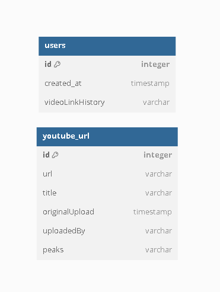

# edmundN

## **The Sauce but the s is silent**  

Executive Summary  
================================================================================ 
Capture your youtube engagement data for analysis by using data that provides valuable insight and response from your video,as an content creator I can provide you engagement analysis youtube dosent share and can be found no where else.  

================================================================================ 

This program aims to enhance user experience by extending a third-party API to incorporate advanced functionalities for video data management. Key features include the ability to save video metadata and their associated scraped data, enabling users to access and interact with the content more efficiently. By integrating these capabilities, we will provide a more seamless and optimized experience for users, ultimately driving engagement and satisfaction.

application will have  

-post to push a url to the api  
-get will respond with server status  
-delete remove from db a video entry  

relationship
-----------------  
many <---> many  
-many users can upload the same video url saved in link history 
-many urls can be added by  the same user saved in uploadedby 

(supabase ?)
