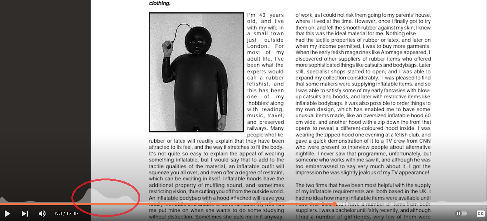
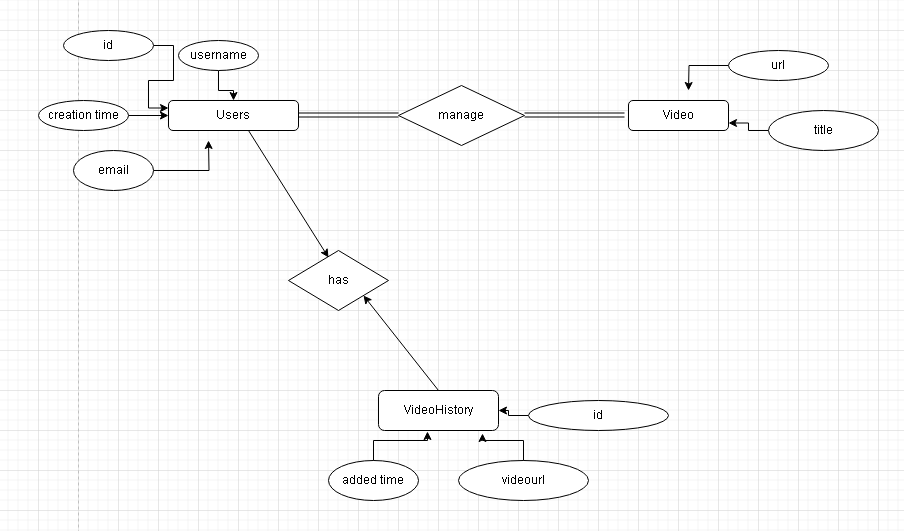

# edmundN

## **CATURAN**  

Executive Summary  
================================================================================ 
**CATURAN** CATURAN captures Youtube engagement data for analysis to allow content creators to gain insight beyond Youtube's provided analytics.  

================================================================================ 

This program aims to enhance user experience by extending a third-party API to incorporate advanced functionalities for video data management. Key features include the ability to save video user metadata into a searchable format, that would allow for users to access and interact with the content more efficiently. By integrating these capabilities, we will provide a more seamless and optimized experience for users, ultimately driving engagement and satisfaction.

 
 

 
 
application will have 
======================  
-create user 
-update user history
-delete user
-create video record
-get history record
-get record of history users
 

relationship
-----------------  
many <---> many  
-many users can have the same video record in history 
-a video record can be added by multiple users 

(supabase ?)
